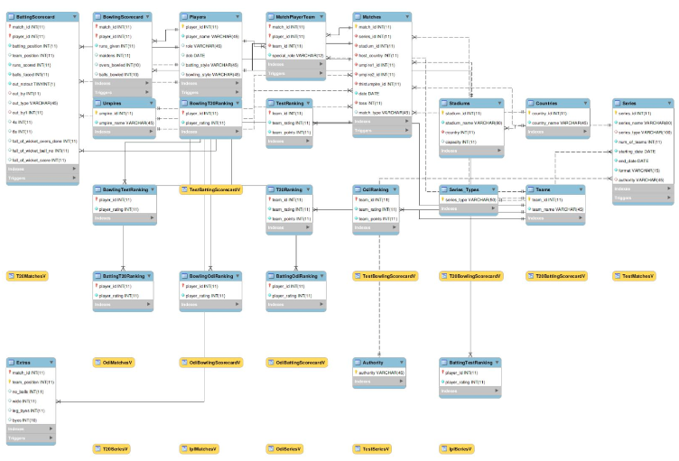

# Cricket database
## Requirements from User Point of View
1. User can be a cricket fan, cricket match analyst and also a cricket match organizer.
2. A Cricket fan can make query regarding player’s score, his previous match performance,
strike rate, average run scored. Such Information about a player can be derived from the
other attributes.
3. While a match is going on, user can make query regarding team performance in particular
country, particular stadium and also performance of team or player against particular
team.
4. A Organizer like ICC or BCCI will make query regarding how much test match, odi
match and T20 match a particular team has played. Which are the team which have not
played enough matches against each other(This can be a relation).
5. National cricket team selectors can make a complex query like how is the performance of
a player in previous k matches and What bowlers has performed well in previous k
matches.
6. User can make query regarding a particular series, man of the match in that series,
highest scorer, best bowler, winner of the series.
7. User will also like to know the current ICC ranking(This will be a table in the database).
8. User can also query for the previous records like Most Runs, Highest Scores, Best
Batting Average, Best Batting Strike Rate, Most Hundreds, Most fifties, Longest Six,
Most fours, Most Sixes, Most Nineties. These information either can be stored or can be
treated as derived attributes.
9. Suppose a researcher want to improve the current D/L method or wants to compare
kleiber rain rule with D/L method then he/she can query for all the matches which were
affected due to rain.
10. A user expects that his queries are answered as fast as possible hence its a challenge for
developer is to optimize database to fulfil the requirement.
11. We can do any kind of data analysis(as any kind of data is available through queries in
DBMS) over say run scored then want to draw some important insights e.g. against which
team or which player it’s hard to score the run and later can use to improve performance.
12. Similar version cricket database can also be used for the college cricket match in IIT
Palakkad to keep a record and track the performance of players so that it becomes easier
for the authorities to choose the best player based on their previous performance.

## ERD Diagram


## Table Schema


## VIEWS :
1. OdiMatchesView: Select all the ODI matches organised by ICC from Matches Table.
2. OdiSeriesView: Select all the ODI series organised by ICC from Series Table.
3. T20MatchesView: Select all the T20 matches organised by ICC from Matches Table.
4. T20SeriesView: Select all the T20 series organised by ICC from Series Table.
5. TestMatchesView: Select all the Test matches organised by ICC from Matches Table.
6. TestSeriesView: Select all the Test series organised by ICC from Series Table.
7. OdiBattingScorecardView: Select the batting scorecard for all ODI Matches organised
by ICC.
8. OdiBowlingScorecardView: Select the bowling scorecard for all ODI Matches
organised by ICC.
9. T20BattingScorecardView: Select the Batting scorecard for all T20 Matches organised
by ICC.
10. T20BowlingScorecardView: Select the bowling scorecard for all T20 Matches
organised by ICC.
11. TestBattingScorecardView: Select the batting scorecard for all Test Matches organised
by ICC.
12. TestBowlingScorecardView: Select the bowling scorecard for all Test Matches
organised by ICC.
13. IplMatchesView: Select all the IPL Matches from Matches Table.
14. IplSeriesView: Select all the IPL Series from Series Table.
15. IplBattingScorecardView: Select the batting scorecard for all IPL Matches.
16. IplBowlingScorecardView: Select the bowling scorecard for all IPL Matches.
17. CAOdiMatchesView: Select all the ODI matches organised by Cricket Australia from
Matches Table.
18. CAOdiSeriesView: Select all the ODI series organised by Cricket Australia from Series
Table.
19. CATestMatchesView: Select all the Test matches organised by Cricket Australia from
Matches Table.
20. CATestSeriesView: Select all the Test series organised by Cricket Australia from Series
Table.
21. CAT20MatchesView: Select all the T20 Matches organised by Cricket Australia from
Matches Table.
22. CAT20SeriesView: Select all the T20 series organised by Cricket Australia from Series
Table.
23. CAOdiBattingScorecardView: Select the batting scorecard for all Odi Matches
organised by CA.
24. CAOdiBowlingScorecardView: Select the bowling scorecard for all Odi Matches
organised by CA.
25. ECBOdiMatchesView: Select all the ODI matches organised by ECB from Matches
Table.
26. ECBOdiSeriesView: Select all the ODI series organised by ECB from Series Table.
27. ECBTestMatchesView: Select all the Test matches organised by ECB from Matches
Table.
28. ECBTestSeriesView: Select all the Test series organised by ECB from Series Table.
29. ECBT20MatchesView: Select all the T20 Matches organised by ECB from Matches
Table.
30. ECBT20SeriesView: Select all the T20 series organised by ECB from Series Table.
31. IplBattingScorecardView: Select the batting scorecard for all IPL Matches.
32. IplBowlingScorecardView: Select the bowling scorecard for all IPL Matches.

## ROLES :
1. ICC_ODI: Role for writing to all the ODI matches, series, scorecard and ranking for the
series organised by ICC.
2. ICC_Test: Role for writing to all the Test matches, series, scorecard and ranking for the
series organised by ICC.
3. ICC_T20: Role for writing to all the T20 matches, series, scorecard and ranking for the
series organised by ICC.
4. BCCI_ODI: Role for writing to all the ODI matches, series, scorecard and ranking for
the series organised by BCCI.
5. BCCI_Test: Role for writing to all the Test matches, series, scorecard and ranking for
the series organised by BCCI.
6. BCCI_T20: Role for writing to all the T20 matches, series, scorecard and ranking for the
series organised by BCCI.
7. CA_ODI: Role for writing to all the ODI matches, series and scorecard for the series
organised by Cricket Australia.
8. CA_T20: Role for writing to all the T20 matches, series and scorecard for the series
organised by Cricket Australia.
9. CA_Test: Role for writing to all the Test matches, series and scorecard for the series
organised by Cricket Australia.
10. ECB_ODI: Role for writing to all ODI matches, series and scorecard for the series
organised by ECB.
11. ECB_T20: Role for writing to all T20 matches, series and scorecard for the series
organised by ECB.
12. ECB_Test: Role for writing to all Test matches, series and scorecard for the series
organised by ECB.


## TRIGGERS :
Triggers are used in the tables just to check the constraints of the attributes in the tables as
“CHECK” does not work in MySQL MariaDB.
1. Check team_position: If match format is Test then team_position should be between 1
and 4 else team position should be between 1 and 2.
```
DELIMITER ;;
/*!50003 CREATE*/ /*!50017 DEFINER=`root`@`localhost`*/ /*!50003 TRIGGER
`cricket`.`Extras_BEFORE_INSERT` BEFORE INSERT ON `Extras` FOR EACH
ROW
BEGIN
IF 'Test' in (SELECT S.format from Series as S natural join Matches as T
WHERE T.match_id = New.match_id) THEN
IF New.team_position not between 1 and 4 THEN
SIGNAL SQLSTATE '45000'
SET MESSAGE_TEXT = 'team_position field is not valid';
END IF;
ELSEIF New.team_position not between 1 and 2 THEN
SIGNAL SQLSTATE '45000'
 SET MESSAGE_TEXT = 'team_position field is not valid';
END IF;
END */;;
DELIMITER ;
```

2. Check special Role of Player: Special role should be one of ('wicket-keeper', 'captain',
'extra', '')
```
DELIMITER ;;
/*!50003 CREATE*/ /*!50017 DEFINER=`root`@`localhost`*/ /*!50003 TRIGGER
`cricket`.`MatchPlayerTeam_BEFORE_INSERT` BEFORE INSERT ON
`MatchPlayerTeam` FOR EACH ROW
BEGIN
  IF New.special_role not in ('wicket-keeper', 'captain', 'extra', '') THEN
  SIGNAL SQLSTATE '45000'
   SET MESSAGE_TEXT = New.special_role;
  END IF;
END */;;
DELIMITER ;
```

3. Check Match Type:
```
DELIMITER ;;
/*!50003 CREATE*/ /*!50017 DEFINER=`root`@`localhost`*/ /*!50003 TRIGGER
`cricket`.`Matches_BEFORE_INSERT`
 BEFORE INSERT ON `Matches`
 FOR EACH ROW
BEGIN
  IF New.match_type not in ("normal", "semi-final", "final") THEN
  SIGNAL SQLSTATE '45000'
  SET MESSAGE_TEXT = 'match_type field is not valid';
  END IF;
END */;;
DELIMITER ;
```

4. Check Batting and Bowling Style of Players:
```
DELIMITER ;;
/*!50003 CREATE*/ /*!50017 DEFINER=`root`@`localhost`*/ /*!50003 TRIGGER
`cricket`.`Players_BEFORE_INSERT`
BEFORE INSERT ON `Players`
FOR EACH ROW
BEGIN
  IF New.role not in ('Batsman', 'Bowler', 'Batting-Allrounder',
  'Bowling-Allrounder', 'WK-Batsman') THEN
  SIGNAL SQLSTATE '45000'
   SET MESSAGE_TEXT = New.role;
  END IF;
   IF New.batting_style not in ('Left Handed Bat', 'Right Handed Bat')
   THEN
  SIGNAL SQLSTATE '45000'
   SET MESSAGE_TEXT = 'batting_style field is not valid';
   END IF;
   IF New.bowling_style not in ('Right-arm fast', 'Right-arm medium',
  'Right-arm fast-medium', 'Right-arm legbreak', 'Right-arm offbreak',
   'Left-arm fast', 'Left-arm medium', 'Left-arm fast-medium',
   'Left-arm chinaman', 'Left-arm orthodox', '') THEN
  SIGNAL SQLSTATE '45000'
   SET MESSAGE_TEXT = 'bowling_style field is not valid';
  END IF;
END */;;
DELIMITER ;
```

5. Check Match Format: Match format should be one of Test, T20 and ODI
```
DELIMITER ;;
/*!50003 CREATE*/ /*!50017 DEFINER=`root`@`localhost`*/ /*!50003 TRIGGER
`cricket`.`Series_BEFORE_INSERT`
BEFORE INSERT ON `Series`
FOR EACH ROW
BEGIN
IF New.format not in ("ODI", "T20", "Test") THEN
SIGNAL SQLSTATE '45000'
 SET MESSAGE_TEXT = "Series: format field is not valid";
END IF;
END */;;
DELIMITER ;
```

6. Number of Balls Bowled by player in a over he did not complete:
```
DELIMITER ;;
/*!50003 CREATE*/ /*!50017 DEFINER=`root`@`localhost`*/ /*!50003 TRIGGER
`cricket`.`BowlingScorecard_BEFORE_INSERT` BEFORE INSERT ON
`BowlingScorecard` FOR EACH ROW
BEGIN
  IF New.balls_bowled not between 0 and 5 THEN
  SIGNAL SQLSTATE '45000'
   SET MESSAGE_TEXT = 'balls_bowled field is not valid';
  END IF;
END */;;
DELIMITER ;
```

## BCNF Analysis
Note : Superkey of initial database (whole database) : { team_id, player_id, series_id, match_id,
umpire_id, stadium_id }
1. In table Matches, functional dependency stadium_id -> host_country should be satisfied
but since stadium_id is not the primary key and also host_country is not subset of
stadium_id, hence table Matches is not in BCNF form and it should be decomposed in
relation.
R1(stadium_id, host_country)
11
R2(match_id, series_id, stadium_id, umpire1_id, umpire2_id, thirdumpire_id,
Date, toss, match_type).
Since we already have a schema R(stadium_id, country) we drop the attribute
host_country from Matches Table.
2. For Tables BattingT20Ranking, BowlingT20Ranking, BattingOdiRanking,
BowlingOdiRanking, BattingTestRanking, BowlingTestRanking and Players, we have
functional dependencies player_id -> player_rating(for each format bowling and batting
ranking) And player_id -> (player_name, dob, role, batting_style, bowling_style). If we
would have had a table which is natural join of all the above tables then also it’s in BCNF
form. Hence instead of having seven tables we could have combined them in one table.
But we chose not to combine them, because combing name is causing NULL values. For
example, a player who has just played ipl and not international cricket will have NULL
value in rating columns.
3. For Tables BattingScorecard, Bowling Scorecard and MatchPlayerTeam, we have
functional dependencies of the form :
(match_id, player_id) -> other_attributes
We could have merged them in one table which will be in BCNF as (match_id, player_id)
is the superkey. But we chose not to merge them, because merging these three tables
were causing unnecessary redundancy and number of attributes of a single table would
have become too much.
The decomposed table is also in the BCNF form because F = closure (F) where F is the
functional dependency as left-side is the super key in all the functional dependencies.
4. Functional dependency team_id -> team_name is responsible for creating the Team table
as team_id is not superkey of the initial database.
5. Similarly, functional dependency series_id -> series_name, series_type, num_of_teams,
start_date, end_date, format, authority is responsible for creating the Series table as
series_id is not superkey of the initial database.
6. Similarily, for tables Matches also, we have the same case as match_id is not the
superkey of initial database
### Conclusion : The whole database is in the BCNF form.

Functions and Stored Procedures
1. Function to find the number of runs scored, given player_id, authority and format.

2. Function to find the number of wickets taken, given player_id, authority and format.

3. Procedure to find the number of matches played by a given team in a given format
organized by given authority.
```
CREATE DEFINER=`root`@`localhost` PROCEDURE `no_of_matches_played`(IN
my_team_id INT, IN my_authority VARCHAR(45), IN my_format VARCHAR(15),
OUT matches_played INT)
BEGIN
 SELECT COUNT(*) INTO matches_played
 FROM Series natural join Matches
 WHERE team_id = my_team_id
 AND authority = my_authority
 AND format = my_format;
END
```

4. function to find the number of matches played in a given stadium given stadium_id and
format.


5. Procedure to find how many times a given batsman is out by a given bowler.
```
CREATE PROCEDURE `findWicketCount` (IN batsman_id INT, IN bowler_id INT,
OUT wicket_count INT))
BEGIN
 (SELECT count(*) INTO wicket_count
15
FROM BattingScorecard
 WHERE player_id = batsman_id
 AND out_by = bowler_id);
END
```

QUERY SECTION
1. Given two team names, start date and end date, display all the series played between the
two teams in the interval given.

```
$starting_date = 2018-02-22
$end_date = 2020-10-10
$team1 = 1
$authority1 = ‘ICC’
$team2 = 2
$authority2 = ‘ICC’
TODO :
    MatchPlayerTeam can be replaced with
    (SELECT distinct match_id, team_id from MatchPlayerTeam)
SELECT distinct series_id, series_name, starting_date
FROM Series natural join Matches natural join MatchPlayerTeam
natural join Teams
WHERE starting_date > "2018-02-22"
and end_date < "2020-10-10"
and team_name = team1 and authority = authority1
and EXISTS (SELECT * FROM MatchPlayerTeam natural join Teams as
      MPT
      WHERE MPT.team_name = team2
      and MPT.authority = authority2
      and MPT.match_id = match_id);
```

2. Given a series id return all the matches in that series.


3. Given a series_id, output team_id and team_name of all the teams who participated in
the series.


4. Given a series_id output team_id and team_name of all the teams who participated in
the series.


 5. Given a match id, output match detail.
 ```
 WITH T AS (SELECT * FROM Matches WHERE match_id = ?),
T1 as
 (SELECT MAX(MPT.team_id) as team1_id, MIN(MPT.team_id) as team2_id
 FROM T inner join MatchPlayerTeam as MPT ON (T.match_id
=MPT.match_id)),
TEAMS as
 (SELECT T1.team1_id as team1_id, TE1.team_name as team1_name,
 T1.team2_id as team2_id, TE2.team_name as team2_name
 FROM T1 inner join Teams as TE1 ON(TE1.team_id = T1.team1_id)
 inner join Teams as TE2 ON(TE2.team_id = T1.team2_id)),
M1 AS
 (SELECT T.match_id, T.match_type, T.date, T.toss, SE.series_id,
 SE.series_name, ST.stadium_id, ST.stadium_name
 FROM T inner join Stadiums as ST ON (T.stadium_id =
ST.stadium_id)
 inner join Series as SE ON (T.series_id = SE.series_id)),
U1 as
 (SELECT * FROM T inner join Umpires ON (T.umpire1_id =
Umpires.umpire_id)),
U2 as
 (SELECT * FROM T inner join Umpires ON (T.umpire2_id =
Umpires.umpire_id)),
U3 as
 (SELECT * FROM T inner join Umpires ON (T.thirdumpire_id =
Umpires.umpire_id)),
UMPIRES AS
 (SELECT U1.umpire_id as umpire1_id, U1.umpire_name as umpire1_name,
 U2.umpire_id as umpire2_id, U2.umpire_name as umpire2_name,
 U3.umpire_id as thirdumpire_id, U3.umpire_name as
thirdumpire_name
 FROM U1, U2, U3)
SELECT M1.match_id, M1.match_type, M1.date, M1.toss, M1.series_id,
 M1.series_name, M1.stadium_id, M1.stadium_name, TEAMS.team1_id,
 TEAMS.team1_name, TEAMS.team2_id, TEAMS.team2_name,
UMPIRES.umpire1_id,
 UMPIRES.umpire1_name, UMPIRES.umpire2_id, UMPIRES.umpire2_name,
 UMPIRES.thirdumpire_id, UMPIRES.thirdumpire_name FROM TEAMS,
UMPIRES, M1;
```

6. Given a match_id and player_id write a function which returns the number of wickets taken
by the player in the match.
```
CREATE DEFINER=`root`@`localhost` FUNCTION
`getWicketsTaken`(my_match_id INT, my_player_id INT) RETURNS
int(11)
BEGIN
    DECLARE wicketsTaken INT;
    SELECT COUNT(*) INTO wicketsTaken
    FROM BattingScorecard
    WHERE match_id = my_match_id
    AND out_by = my_player_id;
    RETURN wicketsTaken;
END
SAMPLE QUERY :
SELECT match_id, player_name, getWicketsTaken(match_id, player_id) FROM
BowlingScorecard natural join Players;
```
7. Given a stadium id and format return the number of match played on the stadium.


8. Given player_id, authority and format, return the totals runs scored and total wickets
taken by the player in that format.


9. Given match id and team id, write a function to find number of runs scored by the team
in that match.
```
CREATE DEFINER=`root`@`localhost` FUNCTION
`getTeamRuns`(my_match_id INT, my_team_id INT) RETURNS int(11)
BEGIN
    DECLARE team_runs INT;
    DECLARE extra_runs INT;
    DECLARE my_team_position INT;
    SET extra_runs = getExtraRuns (my_match_id, my_team_id);
    SELECT SUM(runs_scored) INTO team_runs
    FROM Series NATURAL JOIN Matches NATURAL JOIN
    BattingScorecard NATURAL JOIN MatchPlayerTeam
    WHERE match_id= my_match_id
    AND team_id = my_team_id;
    IF team_runs IS NULL
    THEN SET team_runs = 0;
    END IF;
    RETURN team_runs + extra_runs;
END
```

10. Given match_id, find the out who won the match or if it is a tie

```
CREATE DEFINER=`root`@`localhost` FUNCTION
`getMatchWinner`(my_match_id INT) RETURNS varchar(45) CHARSET
utf8mb4
BEGIN
    DECLARE my_team1 INT;
    DECLARE my_team2 INT;
    DECLARE team1_runs INT;
    DECLARE team2_runs INT;
    DECLARE team1_name VARCHAR(45);
    DECLARE team2_name VARCHAR(45);
    DECLARE winner VARCHAR(45);
    /* getting team ids of the teams playing the match
    with match_id <my_match_id>
    */
    SELECT distinct team_id INTO my_team1
    FROM MatchPlayerTeam
    WHERE match_id = my_match_id
    LIMIT 1;
    SELECT distinct team_id INTO my_team2
    FROM MatchPlayerTeam
    WHERE match_id = my_match_id
    AND team_id <> my_team1;
    SET team1_name = getTeamName (my_team1);
    SET team2_name = getTeamName (my_team2);
    SET team1_runs = getTeamRuns (my_match_id, my_team1);
    SET team2_runs = getTeamRuns (my_match_id, my_team2);
    IF team2_runs > team1_runs
    THEN SET winner = team2_name;
    ELSEIF team1_runs > team2_runs
    THEN SET winner = team1_name;
    ELSE SET winner = "TIE";
    END IF;
    RETURN winner;
END
```


